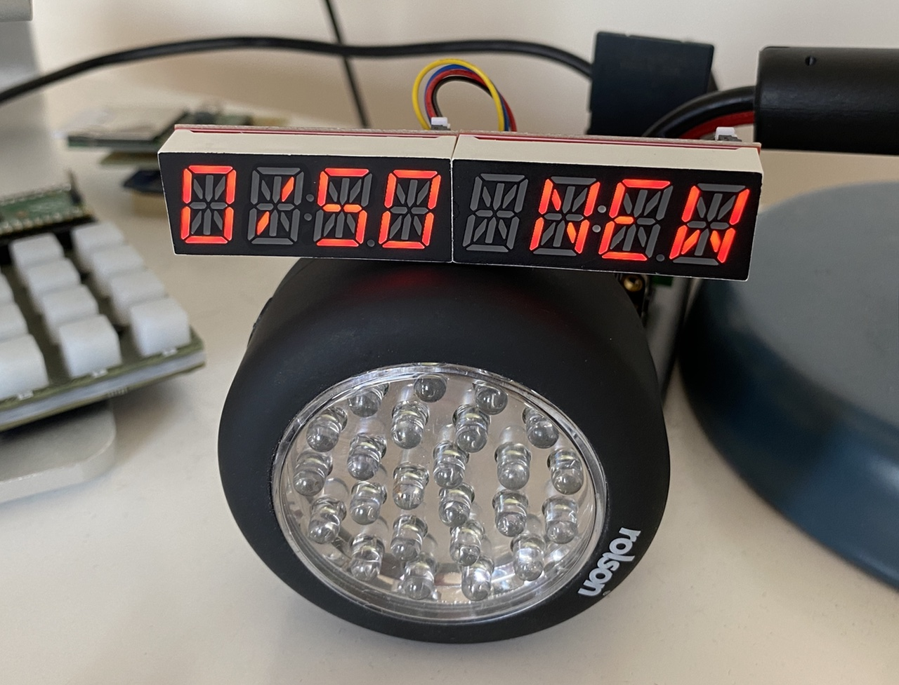

# RP2040 Desktop Email Inbox Indicator

A desktop email inbox status display based on the [Raspberry Pi RP2040](https://www.raspberrypi.com/products/rp2040/) — on the [Adafruit Trinkey RP2040](https://www.adafruit.com/product/5056) — and two [SparkFun Qwiic Alphanumeric Displays](https://www.sparkfun.com/products/16916).

## Requirements

1. An [Adafruit Trinkey RP2040](https://www.adafruit.com/product/5056) loaded with [CircuitPython](https://circuitpython.org/board/adafruit_qt2040_trinkey/).
1. Two [SparkFun Qwiic Alphanumeric Displays](https://www.sparkfun.com/products/16916).
1. Two short QT Stemma/Qwiic cables.
1. A USB-A (female) to USB-C (male) adaptor if your computer only has USB-C ports.
1. Your email provider’s IMAP server URL and port number.
1. Your email access credentials.

## Hardware Setup

1. On the back of one display, solder the `A0` pads to connect them. This will be the left-hand LED as seen from the front.
1. Glue, tape or Blu-tac the two displays together, the soldered on the left, the unsoldered one on the right, as view from the front.
1. Connect the two displays together using a QT Stemma/Qwiic cable and the two closest QT Stemma/Qwiic connectors.
1. Connect the the Trinkey using a QT Stemma/Qwiic cable to the right-hand, unsoldered display.
1. Plug the Trinkey into a USB-A port on your computer. You may need to use an adaptor.

## Software Setup

1. Open a terminal on your computer and `cd` to the directory in which you store your repos.
1. Enter `git clone https://github.com/smittytone/pico-imap`.
1. Enter `cd pico-imap`.
1. Enter `git submodule update --init`.
1. Enter `chmod +x install.sh`.
1. Optionally, enter `./install.sh` to add the code to the Trinkey and copy the host app to your home directory.
    * If you don’t use the script, you will need to copy the files manually.
1. Edit the **copied** `secrets.py` file — ie. the one that isn’t in the cloned repo — and add your credentials, etc.
    * On macOS, the ports are typically `/dev/cu.usbmodem<something>`. The `<something>` varies based on the USB bus and port used. On Linux, the ports are typically `/dev/ttyACM0` and `/dev/ttyACM1`. For both platforms, the data port will usually be second. On Windows, each serial device is visible as a separate `COM` port. The ports will often be assigned consecutively, console first, but this is not always the case.
1. Run the host app, eg. `python ~/imap.py`.
    * You can use `python ~/imap.py &` to run the code in the background if you prefer.

## Copyright and Licence

The source code in this repository is © 2022, Tony Smith (@smittytone). It is released under the terms of the [MIT Licence](./LICENSE.md)